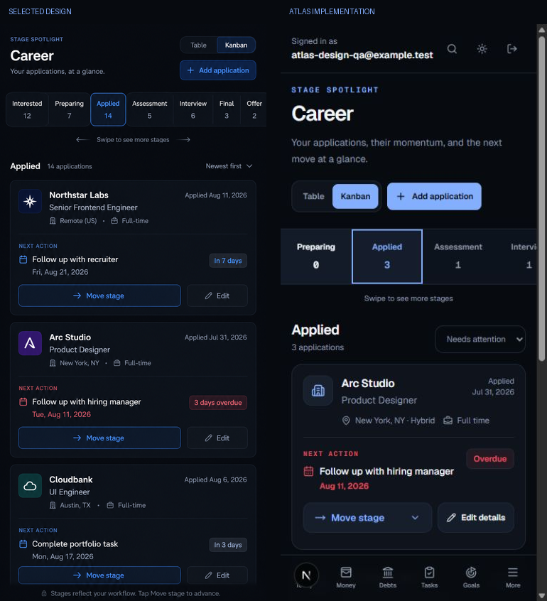

# ATLAS

**Your personal operating system.**

ATLAS is a private, Philippines-first life-management application for seeing money, debts, tasks, goals, career applications, and weekly reflection in one daily route. It stores pesos as integer centavos, displays dates in Asia/Manila, and treats Monday through Sunday as the default review week.

The scoped MVP is implemented and is now in release-candidate validation. See the [MVP status](docs/mvp-status.md) for the current verification snapshot and remaining launch gates.

## Features

- Supabase email/password authentication, recovery, protected routes, and onboarding
- data-driven Today dashboard with deterministic Dayline priorities
- auditable accounts, income/expense transactions, monthly budgets, and server exports
- debt strategies, payment history, atomic balance recalculation, and amortization estimates
- task capture, Today/Upcoming/Overdue/Inbox/Completed views, exact-time scheduling, recommendations, Focus mode, completion feedback, and keyboard shortcuts
- goal CRUD with category colors, rich milestone notes, milestone-driven progress, and related tasks
- customizable career table and Kanban views, application editing, stage history, overdue follow-ups, and conversion guards
- weekly factual summaries, guided reflections, drafts, submission, and score trends
- owner-scoped global search plus filterable, paginated activity history and export
- installable PWA with user-scoped offline page caches and automatic mutation replay
- device privacy mode, sync/storage controls, quick-capture defaults, app-wide font preferences, and scoped session controls
- password/email changes, authenticated account deletion, and TOTP authenticator MFA
- opt-in daily web-push reminders with quiet hours and idempotent Vercel cron delivery
- daily gratitude and productivity prompts, rotating local wisdom, and dark-first responsive visual treatments
- light/dark/system themes, focus states, reduced motion, loading, empty, and error states

## Stack

Next.js 16 App Router, React 19, strict TypeScript, Tailwind CSS v4, shadcn/ui conventions, Supabase PostgreSQL/Auth/SSR, Zod, React Hook Form, Recharts, Lucide, date-fns, Vitest, Testing Library, Playwright, ESLint, Prettier, and npm.

## Local setup

Requirements: Node.js 20.9+ (Node 22 LTS recommended), npm, and a Supabase development project.

```bash
npm ci
Copy-Item .env.example .env.local
npm run dev
```

Open [http://localhost:3000](http://localhost:3000).

Without Supabase variables, the public landing and auth interface run, the production build succeeds, and protected pages redirect to the setup-aware login state.

## Environment variables

```text
NEXT_PUBLIC_SUPABASE_URL=
NEXT_PUBLIC_SUPABASE_PUBLISHABLE_KEY=
SUPABASE_SERVICE_ROLE_KEY=
NEXT_PUBLIC_APP_URL=http://localhost:3000
OPENAI_API_KEY=
NEXT_PUBLIC_VAPID_PUBLIC_KEY=
VAPID_PRIVATE_KEY=
VAPID_SUBJECT=mailto:you@example.com
CRON_SECRET=
```

The service-role key enables authenticated account deletion and the reminder
delivery worker. The VAPID private key and cron secret are server-only. The
OpenAI key remains optional and unused by the current runtime.

## Supabase setup

Apply the migration and run the database tests in a dedicated local/test project:

```bash
supabase start
supabase db reset
supabase test db
```

After the reset, create a development Auth user through the app. To add fictional demo records, run `supabase/seed.sql` in the local Supabase Studio SQL editor. See [Database](docs/database.md) and [Security](docs/security.md).

## Validation

```bash
npm run lint
npm run typecheck
npm run test
npm run build
npm run format:check
```

For browser tests:

```bash
npx playwright install chromium
npm run test:e2e -- --project=chromium
```

See [Testing](docs/testing.md) for authenticated and database fixtures.

## Deployment

The application targets Vercel and Supabase. Apply the database migration first, configure Auth callback URLs, set the three required public runtime variables in Vercel, run CI, and deploy. See [Deployment](docs/deployment.md).

## Folder structure

```text
src/app/          App Router pages, layouts, route handlers, and errors
src/components/   ATLAS, module, shared, and shadcn-style UI components
src/lib/          auth, Supabase, validation, calculations, and mutations
src/test/         Vitest environment
supabase/         migration, seed, and pgTAP tests
e2e/              Playwright public and authenticated workflows
docs/             architecture, database, security, testing, and delivery docs
```

## Documentation

- [MVP status](docs/mvp-status.md)
- [Implementation plan](docs/implementation-plan.md)
- [Architecture](docs/architecture.md)
- [Database](docs/database.md)
- [Security](docs/security.md)
- [Testing](docs/testing.md)
- [Deployment](docs/deployment.md)
- [Future roadmap](docs/future-roadmap.md)
- [Intelligent roadmap](docs/intelligent-roadmap.md)

## Screenshots

The career Kanban comparison below shows the responsive desktop and mobile treatment built from fictional records. Additional component-level visual evidence is catalogued in [design-qa.md](design-qa.md).



## Known limitations

- The current migration chain and pgTAP suite still need a clean run against a disposable Supabase database; Docker Desktop was unavailable during the latest local verification.
- Authenticated Playwright workflows require dedicated test credentials and currently skip without them. Public, PWA, edge-case, responsive, and Axe checks run without credentials.
- Account deletion is intentionally unavailable when `SUPABASE_SERVICE_ROLE_KEY` is absent, and browser reminders remain unavailable until VAPID and cron secrets are configured.
- Production launch still requires the deployment checks in [MVP status](docs/mvp-status.md), including cross-user RLS verification, authenticated E2E, and production Auth/security configuration.
- Dedicated career detail views, bulk operations, and deeper reporting filters are post-MVP enhancements rather than launch blockers.
